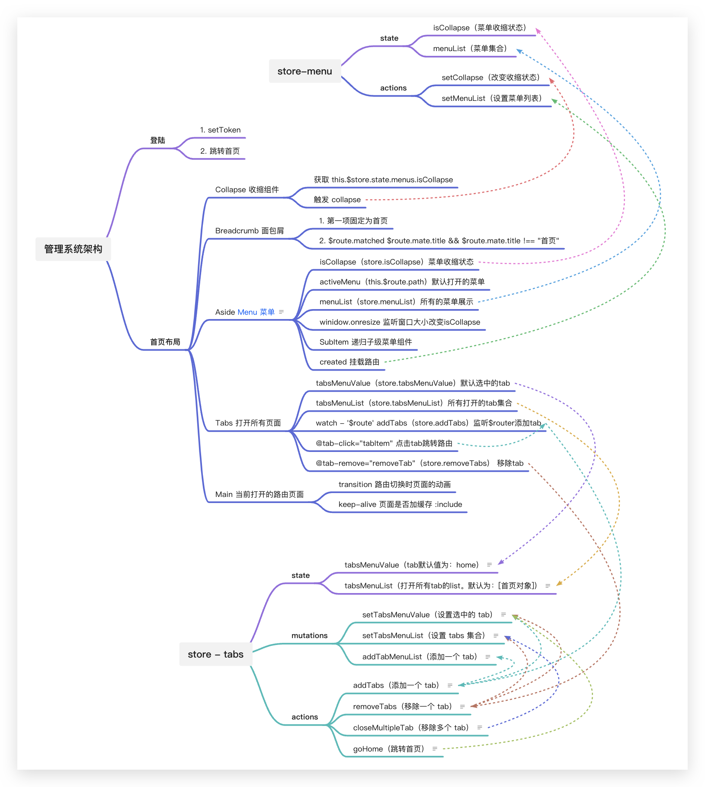

# Vue2 Admin

## Project setup

```sh
pnpm install
```

### Compiles and hot-reloads for development

```sh
pnpm serve
```

### Compiles and minifies for production

```sh
pnpm build
```

### Lints and fixes files

```sh
pnpm lint
```

### Customize configuration

See [Configuration Reference](https://cli.vuejs.org/config/).

## 系统菜单、tabs 用 store 的设计



[掘金文章](https://juejin.cn/post/7132304086937894920)
